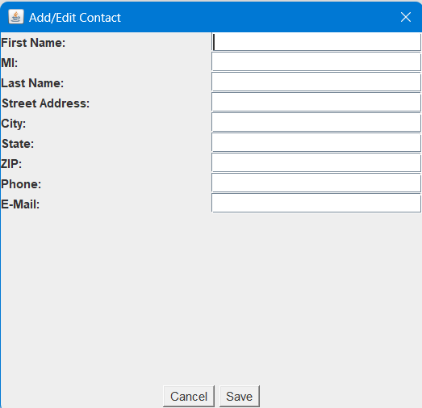

# **SimpleMail Project 📧**

## Overview 🧐

**SimpleMail** is a Java-based desktop application designed to manage contacts and send emails easily. It leverages Swing for the graphical interface and Java I/O for data management. This app allows users to:

- Manage their **Contacts** 📇.
- Send emails using **SMTP** 🌐.
- Configure application settings ⚙️.
- View **System Information** 🖥️.

---

## Features 🔧

- **Contact Management**: Add, edit, and delete contacts with details like name, address, phone number, and email.
- **Email Transmission**: Compose, send, and manage emails via SMTP.
- **Configuration Settings**: Easily update app settings such as SMTP server and email preferences.
- **System Information**: View essential details about the app version, license, and system specs.

---

## 📸 **Screenshots** & User Interface

**MainFrame (Application Window)**  
*Below is a screenshot of the main interface of SimpleMail:*


---

**Contact Management**  
*Here is how you can view, edit, and manage contacts:*




## ⚙️ **Setup & Installation**

### Prerequisites 🛠️

Ensure you have the following installed:

- **Java 8+** (for compiling and running Java files)
- **IDE** like IntelliJ IDEA, Eclipse, or any other Java IDE

### Installation Steps 💻

1. **Clone the repository**:

    ```bash
    git clone https://github.com/Devyalamaddi/ProjectSimpleMail.git
    ```

2. **Navigate to the project folder**:

    ```bash
    cd ProjectSimpleMail
    ```

3. **Compile the Java files**:

    In your terminal or IDE, run the following:

    ```bash
    javac -d bin -cp lib/* src/*.java
    ```

4. **Run the application**:

    To launch SimpleMail, run the following command:

    ```bash
    java -cp "bin;lib/dependency1.jar;lib/dependency2.jar" SimpleMail
    ```

---

## 💡 **How to Use**

1. **Add/Edit Contacts**:  
   - Use the **"Add"** button to create new contacts or **"Edit"** to modify existing ones.
   - Fill in the necessary details (e.g., name, email, phone number, address).
   - Click **"Save"** to store the contact.

2. **Send Email**:  
   - Go to the **Email Composer** screen.
   - Fill in the **Recipient**, **Subject**, and **Body** of the email.
   - Click **"Send"** to dispatch your message via SMTP.

3. **Configuration Settings**:  
   - Open the **Configuration Dialog** via the **"Settings"** menu.
   - Update settings like SMTP server address, port, and email account details.

4. **System Information**:  
   - Access the **System Info** from the **Help** menu to view version info and licensing details.

---

## 🔧 **Data Management & Saving** 🗂️

The SimpleMail application stores user data, such as contacts and configuration settings, in a specific directory on your local machine. The default folder for storing data is:

```
C:\Screenshots\Java & DBMS\projectSimpleMail\data\
```

Make sure the path is accessible, and the directory has write permissions to avoid errors when saving data.

---

## 📜 **Technical Details**

### **Classes and Components** 🏗️

1. **MainFrame.java**  
   The main window that displays all the controls and menus for the app.

2. **SimpleMail.java**  
   The entry point for the application, initializing the main frame and setting folder paths.

3. **SystemInformationDialog.java**  
   A dialog window that shows system information like the app version, license, and other metadata.

4. **Configuration.java**  
   A class for managing configuration settings (e.g., SMTP server, email account info).

5. **Contact.java**  
   Represents a contact with fields like name, address, phone number, and email.

6. **DataStore.java**  
   A singleton class that manages data persistence for the application. It loads and saves contacts and configuration settings.

7. **AlertDialog.java**  
   A dialog window that shows error or success messages to the user.

8. **ContactTableModel.java**  
   A custom model for displaying contacts in a table format.

9. **JContactTable.java**  
   A customized table view that integrates with the `ContactTableModel`.

---

## 🧑‍💻 **Developed by**

- **Devendra Yalamaddi**  
  - B.Tech CSE, VNRVJIET, Hyderabad  
  - GitHub: [@Devyalamaddi](https://github.com/Devyalamaddi)  
  - LinkedIn: [Devendra Yalamaddi](https://www.linkedin.com/in/devendra-yalamaddi-737852211)

---

## 📝 **License**

This project is licensed under the **GPL v3** license. See [LICENSE](LICENSE) for more details.

---

## 🔄 **Contributing**

If you want to contribute to the development of **SimpleMail**, follow these steps:

1. Fork the repository.
2. Create a new branch for your changes.
3. Commit your changes.
4. Push your changes and open a pull request.

---

## 🌍 **Support**

For any issues, feature requests, or bugs, please open an issue on the GitHub repository. You can also contact me directly via email: **devendrayalamaddi@gmail.com**.

---

## 🎉 **Acknowledgements**

- **Java** for building the core functionality.
- **Swing** for creating the user interface.
- **JavaMail API** for handling email transmission.

---

### 🎨 **Custom Animations**

You can include animations in your Java GUI application, such as:

- **Fading effects** when opening and closing windows.
- **Button hover effects** using `MouseListener`.
- **Animated transitions** between screens (using a library like `JavaFX`).

These animations can be added to improve the user experience and make the application feel more responsive and modern.

---

## 🔧 Additional Notes

- **SMTP Server Configuration**: The app uses an SMTP server for sending emails. Make sure to update the configuration with the correct SMTP details (e.g., Gmail, Outlook).
  
- **Icon Handling**: If the icon does not appear, make sure that `icon.png` is placed in the `data/` folder and ensure it's in the right format.


